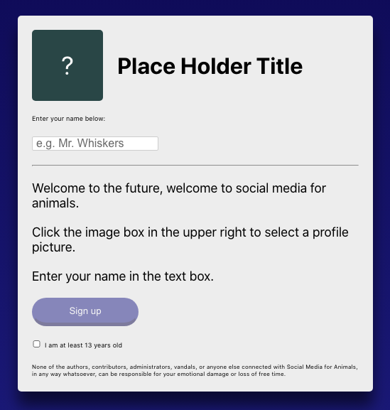
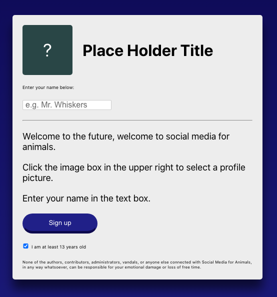

# React Basics 2
## Add the disclaimer
**Desc**
We need a disclaimer so we're not sued into oblivion. Add some tiny text to CYA.

**DoD**
GIVEN I am a user
WHEN I see the homepage
THEN I see a small disclaimer at the bottom

**Bonus**
Pass props to the new component if the user has entered into the text input, the name is passed and instead of `your emotional damage` it reads `<whatever was typed>'s emotional damage`.

**Resources**
Screenshot to match:

Disclaimer text:
> None of the authors, contributors, administrators, vandals, or anyone else connected with Social Media for Animals, in any way whatsoever, can be responsible for your emotional damage or loss of free time.

## Add the age check and signup button
Before users can sign up they need to confirm they are at least 13. Add a check box and button. The button should be disabled unless the box is checked.

**DoD**
GIVEN I am a user
WHEN I try to signup
THEN I cannot click the button if the checkbox is not checked

**Resources**
Screenshot to match:

Screenshot to match:

